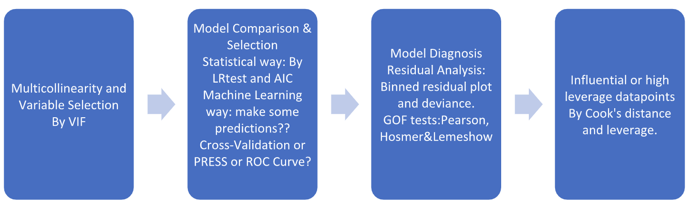

```{r setup, include=FALSE}
knitr::opts_chunk$set(echo = FALSE)
if(!require("bookdown")) {install.packages("bookdown")}
if(!require("knitr")) {install.packages("knitr")}
if(!require("ggplot2")) {install.packages("ggplot2")}
if(!require("gridExtra")) {install.packages("gridExtra")}
library(ggplot2)
library(gridExtra)
library(knitr)
```


# Introduction
Dementia is a common cognitive disease prevalent among elderly people across the world. According to WHO and leading medical centers in US, risk factors include lack of exercise, smoking, alchohol, high blood pressure, depression, low educational attainment and so on. In this project, we look into a dataset collected by the National Alzheimer’s Consulting Center (NACC). The dataset includes demographics, cognitive status and clinical diagnosis of 894 individuals. Our main goal is to explore the association between clinical diagnosis of dementia and self-reported
depression. Meanwhile we also investigate the roles of age, sex, race, family history, marriage status, and education.

# Methods

## Exploratory Data Analysis and Data Preprocessing

  We first carry out exploratory data analysis to get a sense of the distributions of the response variable(dementia diagnosis) and covariates. If the response variable and any of the categorical covariates have extremely imbalanced distributions, we have to come up with some data preprocessing techniques or sampling techniques during model fitting. We also need to check out the distribution of continuous covariates and decide if we need to do any transform based on practical or statistical reasons. 

## Model Fitting and Selection

{#id .class}

# Results

## Exploratory Data Analysis and Data Preprocessing

There are eight variables of importance in the dataset. `CLINDEM` represents the clinical dementia diagnosis, with two possible outcomes "Yes" and "No". Among the covariates five of them are categorical covariates. `DEP` contains diagnosis of depression ("Yes"/"No"). `SEX` stands for subjects' sex ("Male"/"Female"). `RACE` stands for subjects' race ("White"/"Black"). `RLDEM` keeps track of whether a subject has a relative diagnosed with dementia("Yes"/"No"). `MARISTAT` contains the marital status of subjects ("Married"/"Widowed"/"Divorced"/"Separated"/"Never Married"). There are other two continuous covariates. `FEVALAGE` refers to the age when a subject was first evaluated for dementia. `EDUC` refers to the number of schools that an individual completed. 


```{r}
url = "https://raw.githubusercontent.com/skybullbobby/Dementia-GLM/master/data/mds_center9661.csv"
dementia = read.csv(url)
dem_freq = table(dementia$CLINDEM)
```

Among all the 894 subjects, there are `r dem_freq[["Yes"]]` people with dementia and `r dem_freq[["No"]]` who don't. The distribution is balanced, so we don't need to worry about it.

Figure \@ref(fig:categorical) contains barplots for the response variable and five categorical covariates. There is no big issue with the four binary covariates. For the marital status variable, we notice that "Married" takes up a large proportion, so we decide to recode the `MARISTAT` to a binary variable with values "Yes" (corresponding to "Married") and "No"(corresponding to other values).  

```{r subplots}
dem_plot <- ggplot(dementia, aes(x=CLINDEM)) + geom_bar()+
  xlab("")+ggtitle("Dementia")
dep_plot <- ggplot(dementia, aes(x=DEP))+geom_bar()+
  xlab("")+ggtitle("Depression")+theme(text = element_text(size=10))
race_plot <- ggplot(dementia, aes(x=RACE))+geom_bar()+
  xlab("")+ggtitle("Race")+theme(text = element_text(size=10))
relative_plot <- ggplot(dementia, aes(x=RLDEM))+geom_bar()+
  xlab("")+ggtitle("Relative with Dementia")+theme(text = element_text(size=10))
sex_plot <- ggplot(dementia, aes(x=SEX))+geom_bar()+
  xlab("")+ggtitle("Sex")+theme(text = element_text(size=10))
mari_plot <- ggplot(dementia, aes(x=MARISTAT)) + geom_bar() + 
  xlab("")+ggtitle("Marital Status")+theme(text = element_text(size=10),
        axis.text.x = element_text(angle=90, hjust=1))
```


```{r}
dementia$marry = "No"
dementia$marry[which(dementia$MARISTAT=="Married")]="Yes"
dementia$marry = as.factor(dementia$marry)
table(dementia$marry)
```

We then explore the two continuous variables by plotting a histogram for each of them (figure \@ref(fig:continuous)).

```{r}
education <- ggplot(dementia, aes(x=EDUC, y=..density..))+geom_histogram(stat="bin", binwidth=3,colour="black", fill="white")+
  xlab("Years")+ggtitle("Education Years")
fevage <- ggplot(dementia, aes(x=FEVALAGE, y=..density..))+geom_histogram(stat="bin", binwidth=5,colour="black", fill="white")+
  xlab("Age")+ggtitle("First Evaluation Age")
```

Both covariates have a normal distribution, so there isn't anything statistically concerning. Nevertheless we decide to categorize the education years of all the subjects into three bins. The first bin includes those smaller than 12 (no college degree). The second bin includes those between 12 and 18(with a bachelors/masters degree). The third bin includes those larger than 18(with a doctorate degree). As to the first evaluation age, we center it to make the variable more interpretable during model inference. 

```{r}
mapedu <- function(years){
  if (years <= 12){
    return("<=12")
  } else if (years >= 18){
    return(">=18")
  } else{
    return("13-17")
  }
}
dementia$edulevel = apply(dementia["EDUC"], 1, mapedu)
dementia$edulevel = as.factor(dementia$edulevel)

dementia$FEVALAGE = dementia$FEVALAGE - mean(dementia$FEVALAGE)
```

Remove raw variables `NACCID`, `EDUC`.

```{r}
dementia = subset(dementia, select=-c(NACCID,MARISTAT, EDUC))
```


I replot the barplots of the two transformed variables.

```{r}
mari_plot_new <- ggplot(dementia, aes(x=marry)) + geom_bar() + 
  xlab("")+ggtitle("Marital Status")+theme(text = element_text(size=10))

edu_plot_new <- ggplot(dementia, aes(x=edulevel))+geom_bar()+
  xlab("")+ggtitle("Years of Education")+theme(text = element_text(size=10))

grid.arrange(mari_plot_new, edu_plot_new, ncol=2, nrow=1)
```

```{r}
testdata = subset(dementia, select=-c(FEVALAGE))

varnames = colnames(testdata)
pvals = matrix(NA, 7, 7)
rownames(pvals) = varnames
colnames(pvals) = varnames
for (i in 1:6){
  for (j in (i+1):7){
    contingency <- table(testdata[,i],testdata[,j])
    testresult <- chisq.test(contingency,correct=FALSE)
    pvals[i, j] = testresult$p.value
  }
}
```

```{r}
kable(pvals)
```

T tests with FEVALAGE

```{r}
t.test(FEVALAGE~CLINDEM, data=dementia)
t.test(FEVALAGE~DEP, data=dementia)
```


```{r}
dep_dem <- ggplot(dementia, aes(x=CLINDEM, fill=DEP)) + geom_bar()+
  xlab("")+ggtitle("Dementia")+
  labs(fill="Depression")+theme(text = element_text(size=10))
race_dem <- ggplot(dementia, aes(x=CLINDEM, fill=RACE)) + geom_bar()+
  xlab("")+ggtitle("Dementia")+
  labs(fill="Race")+theme(text = element_text(size=10))
rl_dem <- ggplot(dementia, aes(x=CLINDEM, fill=RLDEM)) + geom_bar()+
  xlab("")+ggtitle("Dementia")+
  labs(fill="Relative")+theme(text = element_text(size=10))
sex_dem <- ggplot(dementia, aes(x=CLINDEM, fill=SEX)) + geom_bar()+
  xlab("")+ggtitle("Dementia")+
  labs(fill="Sex")+theme(text = element_text(size=10))
mar_dem <- ggplot(dementia, aes(x=CLINDEM, fill=marry)) + geom_bar()+
  xlab("")+ggtitle("Dementia")+
  labs(fill="Married")+theme(text = element_text(size=10))

edu_dem <- ggplot(dementia, aes(x=CLINDEM, fill=edulevel)) + geom_bar()+
  xlab("")+ggtitle("Dementia")+
  labs(fill="Education Years")+theme(text = element_text(size=10))
grid.arrange(dep_dem, race_dem, rl_dem, sex_dem,mar_dem,edu_dem, ncol=3, nrow=2)
```

```{r}
fevage_group <- ggplot(dementia, aes(x=FEVALAGE, y=..density..,fill=CLINDEM))+geom_histogram(stat="bin", binwidth=5, alpha=0.2,colour="black")+labs(fill="Dementia")+xlab("Centered FEVALAGE")
```

## Model Fitting and Selection


# Discussion

# Contribution from each Team Member

# References

1. [WHO description of dementia](https://www.who.int/news-room/fact-sheets/detail/dementia)

2. [Mayo Clinic description of dementia](https://www.mayoclinic.org/diseases-conditions/dementia/symptoms-causes/syc-20352013)


# Appendix


```{r categorical, fig.cap="Barplots of Dementia Diagnosis and Categorical Covariates", fig.width=7, fig.height=5}
grid.arrange(dem_plot, dep_plot, race_plot, relative_plot, sex_plot,mari_plot, ncol=3, nrow=2)
```


```{r continuous, fig.cap="Barplots of Continuous Covariates", fig.width=7, fig.height=3}
grid.arrange(education, fevage, ncol=2, nrow=1)
```

